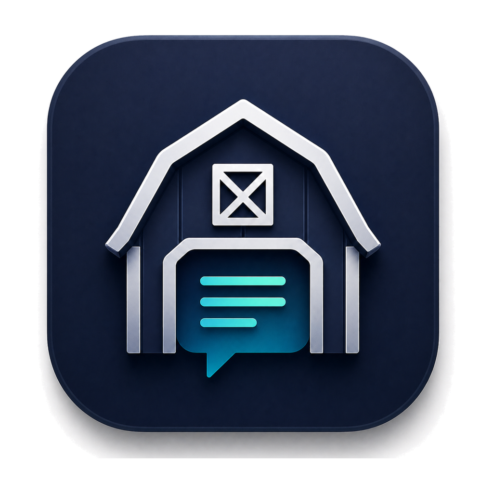

<p align="center">
  
</p>

<h1 align="center">PromptBarn</h1>

<p align="center">
  <strong>An offline-first desktop workbench for storing, organizing, and reusing AI prompts locally.</strong>
</p>

<p align="center">
  
  
  
  
  
  
  
  
  
</p>

---

PromptBarn keeps your prompt library close at hand without accounts, cloud sync, telemetry, external AI APIs, or remote services. It is built as a hardened Electron app with a local SQLite database, fast full-text search, reusable prompt variables, and import/export tools for keeping your workflow portable.

## Highlights

- **Local by design**: prompts, tags, categories, and search indexes live in SQLite on your machine.
- **Prompt templates**: write reusable prompts with `{{variables}}`, then fill them from a generated variable panel.
- **Fast search**: SQLite FTS5 indexes prompt titles, descriptions, and body content for quick retrieval.
- **Organized library**: combine categories and tags to keep a growing prompt collection navigable.
- **Portable backups**: import and export your library as JSON.
- **Hardened desktop shell**: context isolation, sandboxing, strict preload boundaries, and no renderer access to Node.js.

## Tech Stack

| Area | Technology |
| --- | --- |
| Desktop runtime | Electron |
| App bundling | electron-vite, Vite |
| Interface | React, Tailwind CSS, lucide-react |
| Language | TypeScript strict mode |
| State | Zustand |
| Database | SQLite, better-sqlite3, FTS5 |
| Validation | Zod |
| Packaging | electron-builder |

## Getting Started

### Requirements

- Node.js 20 or newer
- npm

### Install

```bash
npm install
```

`better-sqlite3` is a native dependency. The `postinstall` script runs `electron-builder install-app-deps` so the module is rebuilt for the Electron runtime.

### Run Locally

```bash
npm run dev
```

### Validate And Build

```bash
npm run typecheck
npm run build
```

### Package

```bash
npm run package
```

The packaged output is written to `dist/`.

## Project Structure

```text
src/
  main/       Electron main process, window hardening, IPC registration
  preload/    Typed window.promptBarn bridge exposed to the renderer
  renderer/   React desktop interface
  shared/     Shared schemas, types, and contracts
assets/       App icons and packaged visual assets
```

## Architecture Notes

- Renderer code does not access Node.js, Electron internals, the filesystem, or SQLite directly.
- SQLite logic lives in `src/main/database`.
- IPC handlers live in `src/main/ipc` and validate inputs before touching the database.
- The preload script exposes only the typed `window.promptBarn` API.
- SQL stays in repository/database modules and uses prepared statements.
- Local app data is stored under Electron `userData`.

## Security Defaults

PromptBarn keeps the Electron window locked down:

- `contextIsolation: true`
- `nodeIntegration: false`
- `sandbox: true`
- no remote content
- strict Content Security Policy
- blocked unexpected navigation
- denied new windows

## License

MIT
